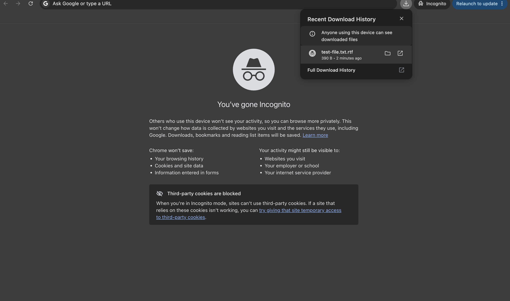

# Azure Blob Storage Labs

Hands on Azure Blob Storage labs completed as part of AZ 104 preparation.

## Labs Completed

### 1. Blob Storage Lifecycle Management

* Created an Azure Storage Account and Blob container.
* Uploaded a test blob.
* Configured a lifecycle management policy.
* Created an IF/THEN rule to automatically transition blobs to the Cool tier.
* Practiced using storage tiers to optimize cost based on data access patterns.

### 2. Public Website Storage

Configured Azure Blob Storage to support a highly available public website containing images, videos, and documents.

* Configured **GZRS** for high availability and regional redundancy.
* Enabled **anonymous Blob access**.
* Created a `website-content` container.
* Enabled **Blob soft delete** for recovery.
* Enabled **Blob versioning** to preserve previous versions.
* Uploaded and modified a test blob to verify versioning.
* Tested recovery by restoring a previous blob version.

## Skills Practiced

* Azure Blob Storage
* Storage accounts
* Blob containers and blobs
* GZRS redundancy
* Anonymous public access
* Blob versioning
* Blob soft delete
* Lifecycle management
* Storage access tiers
* Blob recovery
* Azure Portal administration

## Azure Blob SAS Security

Configured a Shared Access Signature (SAS) for a specific Azure Blob to provide controlled, temporary access without exposing the storage account access key.

### Configuration
- Read-only permissions
- HTTPS-only access
- Time-limited access
- Scoped to a specific blob

### Validation
Tested the generated SAS URL in an Incognito browser session and successfully accessed/downloaded the blob.

### Security Consideration
SAS follows the principle of least privilege by limiting access to the required resource, permissions, protocol, and time period. Short expiration periods reduce the potential impact if a SAS token is compromised.
